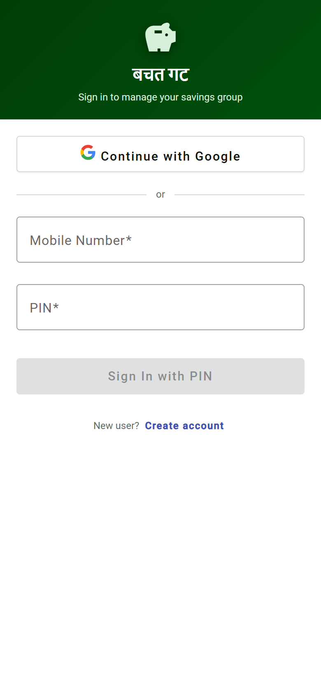
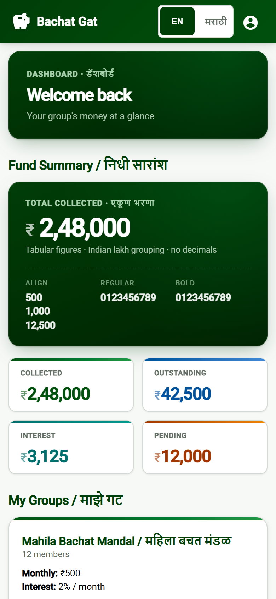
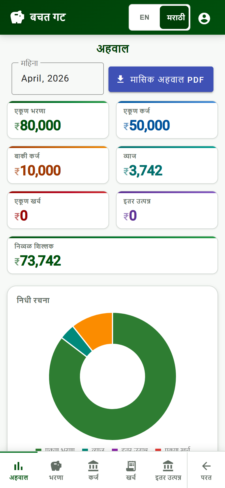
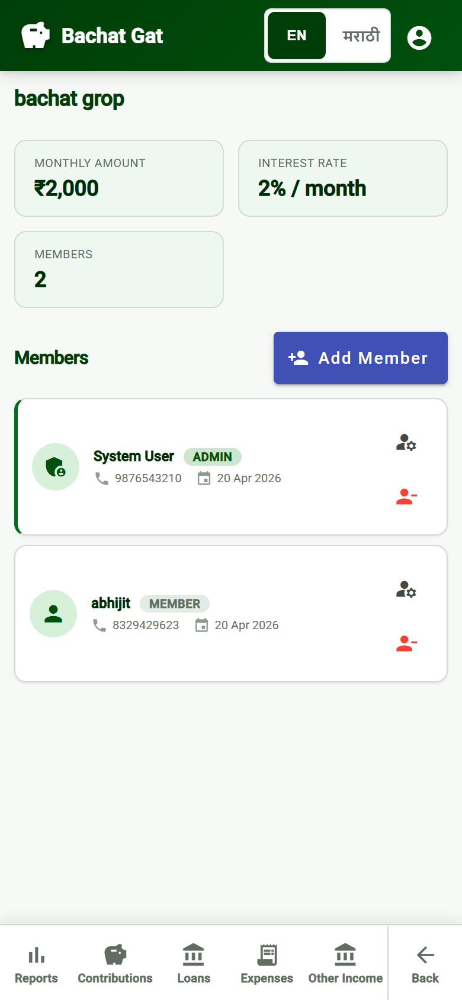
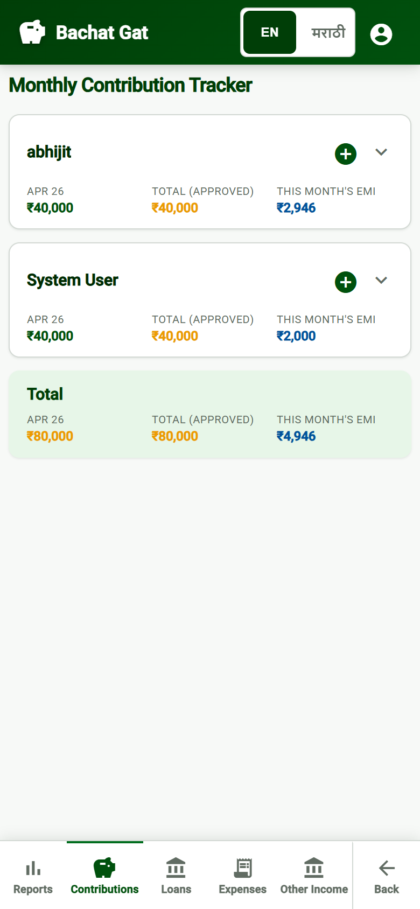
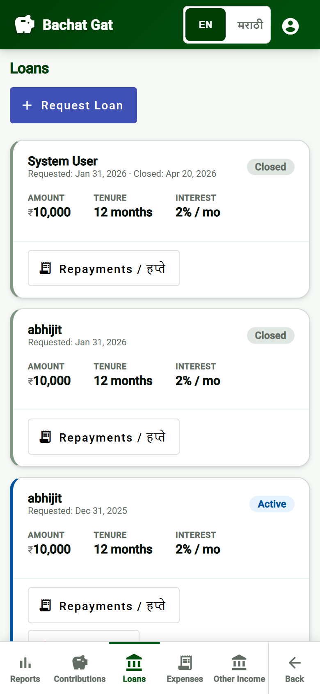
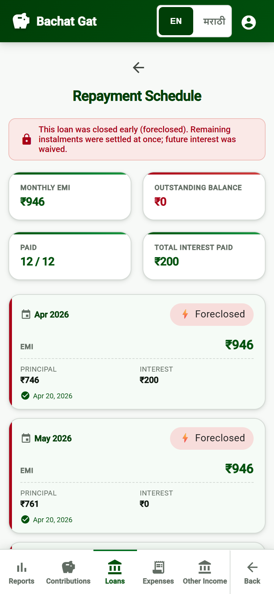
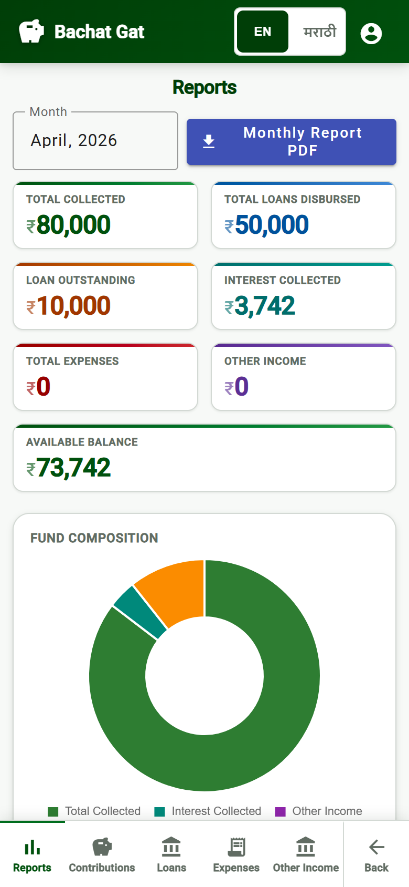
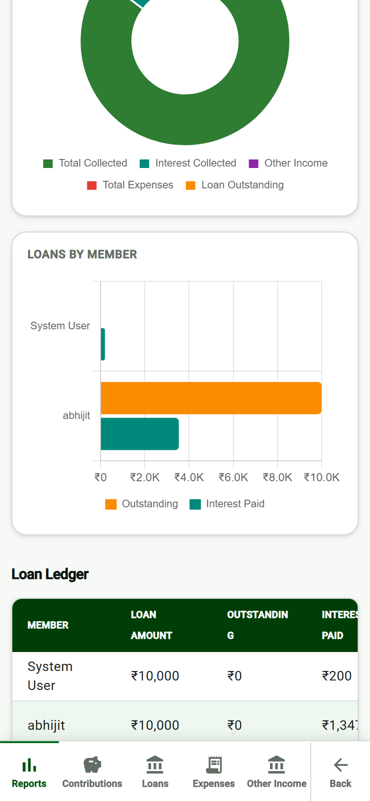

# बचत गट · BachatGat

**Your savings group, on your phone.**

*[मराठीत वाचा](SUMMARY.mr.md)*

---

BachatGat is a simple mobile-first app for running a Bachat Gat (savings group) without registers, calculators, or WhatsApp message-chains. Members track monthly contributions, request and repay loans, and see exactly where the group's money is — all in one place, in **English or मराठी**.

  
  
  

## What members can do

- **Track monthly savings** — every member sees their own contribution history, what's approved, and what's still pending. No paper register.
- **Manage loans transparently** — request a loan, watch the repayment schedule, mark each EMI paid with one tap. Foreclose early and the app waives future interest automatically.
- **See where every rupee is** — a Reports page with stat tiles, a fund-composition donut chart, and a per-member loan ledger. The treasurer's books are open to everyone.
- **Bilingual** — toggle between English and मराठी anywhere in the app. Translations cover every screen, button, and table.
- **Works on any phone** — runs in any modern browser. No app-store install. Mobile-friendly cards and bottom-tab navigation.

  
  
  

## Reports the whole group can read

Stat tiles show **total collected, loans disbursed, outstanding, interest, expenses, and available balance** at a glance. A donut chart breaks down fund composition. A horizontal bar chart shows outstanding loan and interest paid per member — multiple loans by the same person are combined into one entry. Export a monthly PDF for record-keeping.

  
  
  

## Roles

- **Admin** — creates the group, adds members, sets monthly amount and interest rate.
- **Treasurer** — approves contributions, marks EMIs paid, records expenses and other income.
- **Member** — submits monthly contributions, requests loans, views own history and group reports.
- **Auditor** — read-only access to every report and ledger.

## Get started

Ask your group's admin to add you with your phone number — you'll set a 4-digit PIN on first sign-in. That's it.

---

*Made for बचत गट groups in Maharashtra.*
